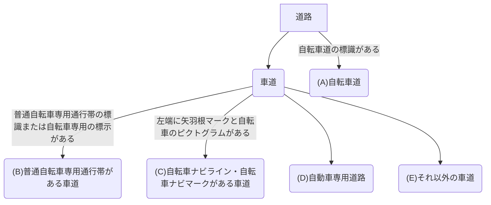
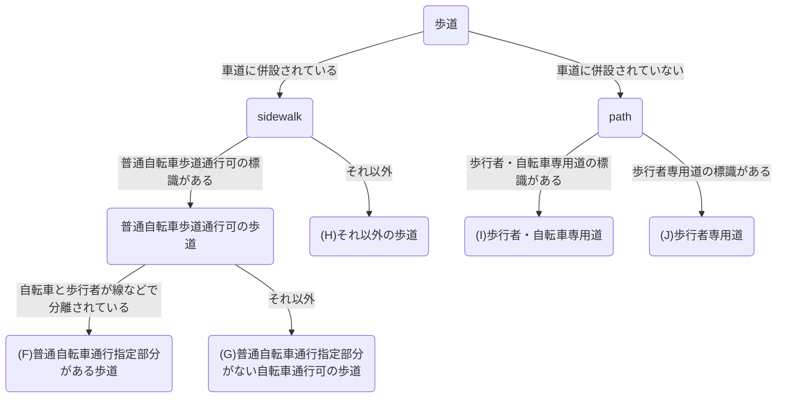

## はじめに

ギークの皆さん，こんにちは！今回は，サイクリストが積極的に利用したい地図データベースであるOpenStreetMap（OSM）の編集方法を紹介します。OSMは，誰でも編集可能なオープンデータです。これは，Wikipediaをイメージしてもらうとわかりやすいでしょう。

地図ならGoogleMapなど，すでに有名なものを使えばいいと思った方も多いかもしれません。しかし，OSMの魅力は情報量の多さとスタイルの柔軟性にあります。OSMには，他の地図サイトでは見られないような詳細な情報が含まれており，快適な走行をサポートしてくれます。また，OSMのデータは自由に利用できるため，自分好みの地図スタイルを作成したり，特定の用途に合わせた地図アプリを開発したものを公開することが可能です。中には，サイクリングに特化したスタイルも存在しており，非常に有用です。

何より，ギークの皆さんであれば，フリーソフトウェアの精神に共感する方も多いはずです。本来，地図とは開かれたものであり，誰もが自由に利用・編集できるべきものです。OSMはその理念をまさに体現しています。地図データを，悪名高い寡占企業から取り戻しましょう！

## OSMの基本

さて，OSMに興味を持っていただけたでしょうか？編集方法を説明する前に，OSMについて知りましょう。OSMでは，地球上に存在するあらゆるオブジェクトを，ノード，ウェイ，リレーションの3つの要素に分け，属性をタグ付けすることでそのオブジェクトを表現します。

## 自転車に関する標識・標示の分類

OSMの編集方法を学ぶ前に，まず日本の道路について学びましょう。
日本の道路には，自転車に関する標識・標示が数多く存在します。これらを正確に区別しておくことは，マッピングの上でも，快適なサイクリングのためにも必要不可欠です。

### 自転車道

まず，最初に紹介するのは，自転車道です。自転車道は，自転車専用の道路であり，「自転車専用」の標識があります。歩行者や自動車は走行できません。


## OSMマッピングの方針

OSMで自転車道をマッピングする際は，以下のフローチャートに従えばよいでしょう。

### 車道の場合


#### (A) 自転車道

自転車道は，縁石や柵などによって他の道路から完全に分離された自転車専用の道路です。
OSMでは，
```plaintext
highway=cycleway
foot=no
```
としてマッピングすればよいでしょう。

#### (B) 普通自転車専用通行帯がある車道

普通自転車専用通行帯は，車道の左端に設けられた，自転車専用の通行帯です。他の自動車は基本的に走行できません。

OSMでは，自転車道として独立させるのではなく，車道に，
```plaintext
highway=*
cycleway=lane
cycleway:lane=advisory
```
というタグ付けをすればよいでしょう。`cycleway=lane`の代わりに，より詳しく`cycleway:both=lane`とすることもありますが，レンダリングソフトによっては`cycleway:both`というタグに対応していないこともあるため，``cycleway=lane``としておくのが無難かもしれません。この辺は好みです。

左端のみにレーンがある場合は，`cycleway=lane`ではなく，
```plaintext
cycleway:left=lane
```
としておきましょう。

#### (C) 自転車ナビライン・自転車ナビマークがある車道

自転車ナビライン・自転車ナビマークは，車道の左端に設けられた，自転車の走行を促進するための標示です。これは法定外表示なので，法的には何の意味もありません。そのため，自動車も自由に走行できます。とはいっても，近年の自転車ネットワーク計画では，ほとんどが，この自転車ナビライン・自転車ナビマークの設置に留まるため，マッピングでは無視できないでしょう。

OSMでは，自転車道として独立させるのではなく，車道に，
```plaintext
highway=*
cycleway=shared_lane
cycleway:lane=pictogram
```
というタグ付けをすればよいでしょう。`cycleway=shared_lane`の代わりに，より詳しく`cycleway:both=shared_lane`とすることもありますが，レンダリングソフトによっては`cycleway:both`というタグに対応していないこともあるため，``cycleway=shared_lane``としておくのが無難かもしれません。この辺は好みです。

左端のみにレーンがある場合は，`cycleway=shared_lane`ではなく，
```plaintext
cycleway:left=shared_lane
```
としておきましょう。

#### (D) 自動車専用道路
自動車専用道路は，自動車以外の通行が禁止された道路です。自転車も通行できません。サイクリストにとっては関係がないだろうと思うかもしれませんが，自転車の走行が禁止されているのであれば，明示的にそれをマッピングすることは有用です。特に，ルート案内機能を利用する場合，自転車が通行できない道路を誤って案内される危険を減らすことができます。

OSMでは，
```plaintext
highway=*
bicycle=no
```
としてマッピングすればよいでしょう。

#### (E) それ以外の車道
それ以外の車道では，自転車は車道の左端を走行します。日本のほとんどすべての道路がこれに該当します。これに関しては，自転車向けにマッピングすることは特にないでしょう。

### 歩道の場合



#### (F) 普通自転車通行指定部分がある歩道

普通自転車通行指定部分がある歩道は，歩道の一部が自転車通行部分として指定されている歩道です。自転車と歩行者が線などで分離されています。

OSMでは，
```plaintext
highway=footway
bicycle=yes
foot=designated
segregated=yes
```
としてマッピングすればよいでしょう。ただし，`bicycle=yes`とすることは賛否両論あるでしょう。OSMには，`bicycle=designated`というタグが存在するからです。しかし，日本国内の歩道は，あくまでも自転車通行可であって歩行者優先という実情があります。また，自転車通行可の歩道であっても，路上がボコボコで走行に耐えない場合も多いです。以上の理由から，車道に併設される歩道については，`bicycle=yes`とする方が適切ではないかと私は考えています。

#### (G) 普通自転車通行指定部分がない自転車通行可の歩道

普通自転車通行指定部分がない自転車通行可の歩道は，歩道全体が自転車通行可として指定されている歩道です。
OSMでは，
```plaintext
highway=footway
bicycle=yes
foot=designated
segregated=no
```
としてマッピングすればよいでしょう。ただし，`bicycle=yes`とすることは賛否両論あるでしょう。OSMには，`bicycle=designated`というタグが存在するからです。しかし，日本国内の歩道は，あくまでも自転車通行可であって歩行者優先という実情があります。また，自転車通行可の歩道であっても，路上がボコボコで走行に耐えない場合も多いです。以上の理由から，車道に併設される歩道については，`bicycle=yes`とする方が適切ではないかと私は考えています。

#### (H) それ以外の歩道

それ以外の歩道では，自転車は歩道を走行できません。OSMでは，
```plaintext
highway=footway
bicycle=no
```
としてマッピングすればよいでしょう。

#### (I) 歩行者・自転車専用道

歩行者・自転車専用道は，歩行者と自転車のみが通行できる道路です。自動車用の道路とは独立していることが多いです。
OSMでは，
```plaintext
highway=path
bicycle=designated
foot=designated
```
としてマッピングすればよいでしょう。

#### (J) 歩行者専用道

歩行者専用道は，歩行者のみが通行できる道路です。自転車は通行できません。
OSMでは，
```plaintext
highway=path
bicycle=no
foot=designated
```
としてマッピングしておくことがよいでしょう。歩行者専用道で明示的に`bicycle=no`としておくことは極めて重要です。なぜなら，自動車専用道路とは違い，自転車が通行できるかどうかが一見してわかりづらいためです。

## おわりに

いかがでしたか？OSMの編集方法について，基本的な部分を紹介しました。OSMは，サイクリストにとって非常に有用な地図データベースであり，積極的に利用・編集することで，より良いサイクリング体験を提供できます。ぜひ，OSMの編集に挑戦してみてください。

最後に伝えておきたいことがひとつあります。それは，

> 間違いを**過剰に**恐れるな。

ということです。OSMやWikipediaでは，一時的に間違った情報を含むことがあり，このことが，オープンデータに対する批判の的になることがあります。確かに，短期的な視点で見れば，情報が正確でないことは大きな欠点になり得ます。そして，我々編集者も，できる限り正確な情報を提供するよう努める必要はあります。しかし，どんなデータにも，間違いは存在します。そして，オープンデータである限り，いずれ修正される傾向にあるでしょう。それよりも大切なことは，オープンデータが，人類の共通知を形成するための，究極の理想形であるということです。あなたも，他の人の間違いを見つけたら，ただ修正しましょう。どんなに小さな修正でも構いません。それは，人類が自由に情報を得ることができるユートピアに向けた，大きな一歩です！そんな夢の世界を，一緒に作りませんか？

<p style="text-align:center;">
  <a href="https://www.openstreetmap.org/edit?editor=id" target="_blank" rel="noopener noreferrer" aria-label="今すぐOpenStreetMapを編集する" style="display:inline-block;padding:0.6rem 1rem;background:#007acc;color:#fff;border-radius:6px;text-decoration:none;font-weight:600;">今すぐOSMを編集する</a>
</p>

## 参考文献