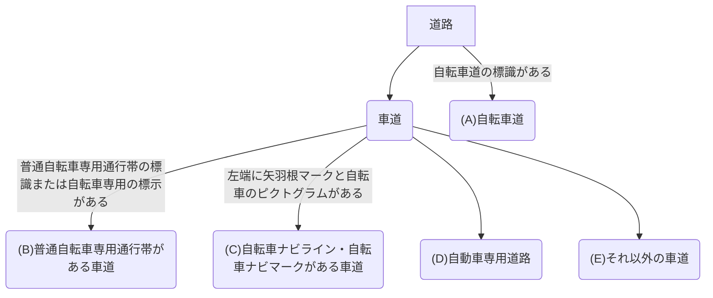
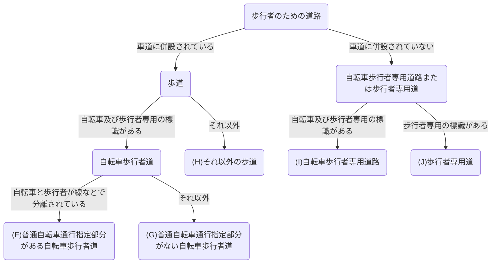

## はじめに

ギークの皆さん，こんにちは！今回は，サイクリストが積極的に利用したい地図データベースであるOpenStreetMap（OSM）の編集方法を紹介します。OSMは，誰でも編集可能なオープンデータです。これは，Wikipediaをイメージしてもらうとわかりやすいでしょう。

地図ならGoogleMapなど，すでに有名なものを使えばいいと思った方も多いかもしれません。しかし，OSMの魅力は情報量の多さとスタイルの柔軟性にあります。OSMには，他の地図サイトでは見られないような詳細な情報が含まれており，快適な走行をサポートしてくれます。また，OSMのデータは自由に利用できるため，自分好みの地図スタイルを作成したり，特定の用途に合わせた地図アプリを開発したものを公開することが可能です。中には，サイクリングに特化したスタイルも存在しており，非常に有用です。

何より，ギークの皆さんであれば，フリーソフトウェアの精神に共感する方も多いはずです。本来，地図とは開かれたものであり，誰もが自由に利用・編集できるべきものです。OSMはその理念をまさに体現しています。地図データを，悪名高い寡占企業から取り戻しましょう！

## OSMの基本

さて，OSMに興味を持っていただけたでしょうか？編集方法を説明する前に，OSMについて知りましょう。OSMでは，地球上に存在するあらゆるオブジェクトを，ノード，ウェイ，リレーションの3つの要素に分け，属性をタグ付けすることでそのオブジェクトを表現します。

## 自転車に関する標識・標示の分類

OSMの編集方法を学ぶ前に，まず日本の道路標識の中で，自転車に関係があるものを復習しましょう。
日本の道路には，自転車に関する標識・標示が数多く存在します。これらを正確に区別しておくことは，マッピングの上でも，快適なサイクリングのためにも必要不可欠です。

### 自転車専用

まず，最初に紹介するのは，「自転車専用」の標識です。この標識がある道路では，歩行者や自動車は走行できません。


### 普通自転車専用通行帯

次に紹介するのは，「自転車専用通行帯」の標識です。この標識がある道路では，車道の左端に自転車専用の通行帯が設けられています。自動車はこの通行帯を基本的に走行できません。


### 自転車及び歩行者専用

次に紹介するのは，「自転車及び歩行者専用」の標識です。この標識は，「自転車歩行者道」と「自転車歩行者専用道路」という2つの異なる道路に対して利用されるため，少し紛らわしいです。OSMマッパーなら，この標識がある2つの道路の違いを理解しておきましょう。見分けるポイントは，**車道に併設されているか否か**です。「自転車歩行者道」とは，車道に併設されている道路のうち，「自転車及び歩行者専用」の標識があるものを指します。一方，「自転車歩行者専用道路」とは，車道に併設されていない道路のうち，「自転車及び歩行者専用」の標識があるものを指します。


### 自転車ナビライン・自転車ナビマーク

最後に紹介するのは，「自転車ナビライン・自転車ナビマーク」です。これは，車道の左端に設けられた，自転車の走行を促進するための標示です。この標示は，法定外表示であり，法的には何の意味もありません。近年の自転車通行環境整備でもっとも積極的に使われている標示なので，目にする機会が増えてきたのではないでしょうか。

この「自転車ナビライン・自転車ナビマーク」は，法定外表示なだけあって，各地でさまざまなデザインが採用されています。以下で紹介するのは，その一例です。


## OSMマッピングの方針

さて，標識・標示を復習したところで，OSMのマッピング方法を学びましょう。OSMでは，地図上の道路をどのようにマッピングするかは，その道路の種類や特性によって異なります。ここでは，自転車道と歩道について，どのようにマッピングすればよいかを説明します。

結論から述べると，OSMで自転車道をマッピングする際は，以下のフローチャートに従えばよいでしょう。

### 車道の場合


#### (A) 自転車道

自転車道は，縁石や柵などによって他の道路から完全に分離された自転車専用の道路です。
OSMでは，
```plaintext
highway=cycleway
foot=no
```
としてマッピングすればよいでしょう。

#### (B) 普通自転車専用通行帯がある車道

普通自転車専用通行帯は，車道の左端に設けられた，自転車専用の通行帯です。他の自動車は基本的に走行できません。

OSMでは，自転車道として独立させるのではなく，車道に，
```plaintext
highway=*
cycleway=lane
cycleway:lane=advisory
```
というタグ付けをすればよいでしょう。`cycleway=lane{:md}`の代わりに，より詳しく`cycleway:both=lane{:md}`とすることもありますが，レンダリングソフトによっては`cycleway:both{:md}`というタグに対応していないこともあるため，`cycleway=lane{:md}`としておくのが無難かもしれません。この辺は好みです。

左端のみにレーンがある場合は，`cycleway=lane{:md}`ではなく，
```plaintext
cycleway:left=lane
```
としておきましょう。

#### (C) 自転車ナビライン・自転車ナビマークがある車道

自転車ナビライン・自転車ナビマークは，車道の左端に設けられた，自転車の走行を促進するための標示です。これは法定外表示なので，法的には何の意味もありません。そのため，自動車も自由に走行できます。とはいっても，近年の自転車ネットワーク計画では，ほとんどが，この自転車ナビライン・自転車ナビマークの設置に留まるため，マッピングでは無視できないでしょう。

OSMでは，自転車道として独立させるのではなく，車道に，
```plaintext
highway=*
cycleway=shared_lane
cycleway:lane=pictogram
```
というタグ付けをすればよいでしょう。`cycleway=shared_lane{:md}`の代わりに，より詳しく`cycleway:both=shared_lane{:md}`とすることもありますが，レンダリングソフトによっては`cycleway:both{:md}`というタグに対応していないこともあるため，`cycleway=shared_lane{:md}`としておくのが無難かもしれません。この辺は好みです。

左端のみにレーンがある場合は，`cycleway=shared_lane{:md}`ではなく，
```plaintext
cycleway:left=shared_lane
```
としておきましょう。

#### (D) 自動車専用道路
自動車専用道路は，自動車以外の通行が禁止された道路です。自転車も通行できません。サイクリストにとっては関係がないだろうと思うかもしれませんが，自転車の走行が禁止されているのであれば，明示的にそれをマッピングすることは有用です。特に，ルート案内機能を利用する場合，自転車が通行できない道路を誤って案内される危険を減らすことができます。

OSMでは，
```plaintext
highway=*
bicycle=no
```
としてマッピングすればよいでしょう。

#### (E) それ以外の車道
それ以外の車道では，自転車は車道の左端を走行します。日本のほとんどすべての道路がこれに該当します。これに関しては，自転車向けにマッピングすることは特にないでしょう。

### 歩道の場合



#### (F) 普通自転車通行指定部分がある自転車歩行者道

普通自転車通行指定部分がある自転車歩行者道は，一部が自転車通行部分として指定されている歩道です。自転車と歩行者が線などで分離されています。

OSMでは，
```plaintext
highway=footway
bicycle=yes
foot=designated
segregated=yes
```
としてマッピングすればよいでしょう。ただし，`bicycle=yes{:md}`とすることは賛否両論あるでしょう。OSMには，`bicycle=designated{:md}`というタグが存在するからです。しかし，日本国内の歩道は，あくまでも自転車通行可であって歩行者優先という実情があります。また，自転車通行可の歩道であっても，路上がボコボコで走行に耐えない場合も多いです。以上の理由から，車道に併設される歩道については，`bicycle=yes{:md}`とする方が適切ではないかと私は考えています。

#### (G) 普通自転車通行指定部分がない自転車歩行者道

普通自転車通行指定部分がない自転車歩行者道は，全体が自転車通行可として指定されている歩道です。
OSMでは，
```plaintext
highway=footway
bicycle=yes
foot=designated
segregated=no
```
としてマッピングすればよいでしょう。ただし，`bicycle=yes{:md}`とすることは賛否両論あるでしょう。OSMには，`bicycle=designated{:md}`というタグが存在するからです。しかし，日本国内の歩道は，あくまでも自転車通行可であって歩行者優先という実情があります。また，自転車通行可の歩道であっても，路上がボコボコで走行に耐えない場合も多いです。以上の理由から，車道に併設される歩道については，`bicycle=yes{:md}`とする方が適切ではないかと私は考えています。

#### (H) それ以外の歩道

それ以外の歩道では，自転車は歩道を走行できません。OSMでは，
```plaintext
highway=footway
bicycle=no
```
としてマッピングすればよいでしょう。

#### (I) 自転車歩行者専用道路

自転車歩行者専用道路は，歩行者と自転車のみが通行できる道路です。自動車用の道路とは独立していることが多いです。
OSMでは，
```plaintext
highway=path
bicycle=yes
foot=designated
segregated=yes|no
```
としてマッピングすればよいでしょう。ゾーン分けがされているなら，`segregated=yes{:md}`，そうでなければ`segregated=no{:md}`を指定しましょう。自転車歩行者道と同様に，`bicycle=designated{:md}`と`bicycle=yes{:md}`のどちらを選ぶかは賛否両論あるでしょう。完全に個人の意見ではありますが，自転車歩行者専用道路に関しては，`bicycle=designated{:md}`でも良いのではと思います。自転車歩行者道は，歩道に後付けで標識が設置されることがあるのに対して，自転車歩行者専用道路は，最初から自転車と歩行者のために設計されていることが多いためです。

#### (J) 歩行者専用道路

歩行者専用道路は，歩行者のみが通行できる道路です。自転車は通行できません。
OSMでは，
```plaintext
highway=path
bicycle=no
foot=designated
```
としてマッピングしておくことがよいでしょう。歩行者専用道路で明示的に`bicycle=no{:md}`としておくことは極めて重要です。なぜなら，自動車専用道路とは違い，自転車が通行できるかどうかが一見してわかりづらいためです。

## おわりに

いかがでしたか？OSMの編集方法について，基本的な部分を紹介しました。OSMは，サイクリストにとって非常に有用な地図データベースであり，積極的に利用・編集することで，より良いサイクリング体験を提供できます。ぜひ，OSMの編集に挑戦してみてください。

最後に伝えておきたいことがひとつあります。それは，

> 間違いを**過剰に**恐れるな。

ということです。OSMやWikipediaでは，一時的に間違った情報を含むことがあり，このことが，オープンデータに対する批判の的になることがあります。確かに，短期的な視点で見れば，情報が正確でないことは大きな欠点になり得ます。そして，我々編集者も，できる限り正確な情報を提供するよう努める必要はあります。しかし，どんなデータにも，間違いは存在します。そして，オープンデータである限り，いずれ修正される傾向にあるでしょう。それよりも大切なことは，オープンデータが，人類の共通知を形成するための，究極の理想形であるということです。あなたも，他の人の間違いを見つけたら，ただ修正しましょう。どんなに小さな修正でも構いません。それは，人類が自由に情報を得ることができるユートピアに向けた，大きな一歩です！そんな夢の世界を，一緒に作りませんか？

<p style="text-align:center;">
  <a href="https://www.openstreetmap.org/edit?editor=id" target="_blank" rel="noopener noreferrer" aria-label="今すぐOpenStreetMapを編集する" style="display:inline-block;padding:0.6rem 1rem;background:#007acc;color:#fff;border-radius:6px;text-decoration:none;font-weight:600;">今すぐOSMを編集する</a>
</p>

## 参考文献

- [自転車の交通ルール/警視庁](https://www.keishicho.metro.tokyo.lg.jp/kotsu/jikoboshi/bicycle/menu/rule.html)
  - 自転車の交通ルールがわかりやすく整理されています。一読をおすすめします
- [highway=cycleway 日本での解釈/OSM Wiki](https://wiki.openstreetmap.org/wiki/JA:Tag:highway%3Dcycleway#%E6%97%A5%E6%9C%AC%E3%81%A7%E3%81%AE%E8%A7%A3%E9%87%88)
  - OSMでの自転車道マッピングで参考になる記事です。標識・標示に基づいた統一的なタグ付け方法が提案されています
- [JA:自転車/OSM Wiki](https://wiki.openstreetmap.org/wiki/JA:%E8%87%AA%E8%BB%A2%E8%BB%8A)
  - こちらは，自転車道マッピング全般に関する情報がまとまっています
  - 本記事に載っていない要素のタグ付け方法が気になる場合は，こちらを参照するとよいでしょう